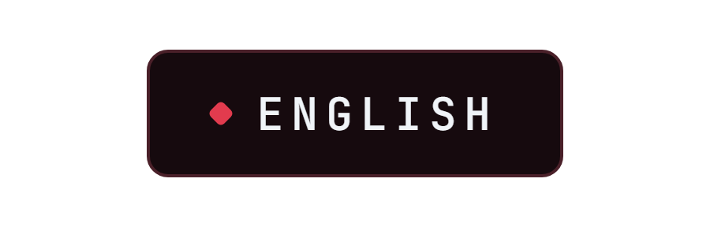
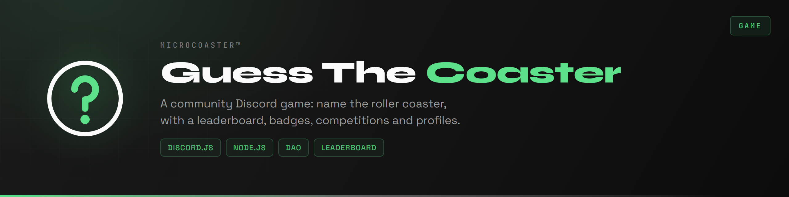
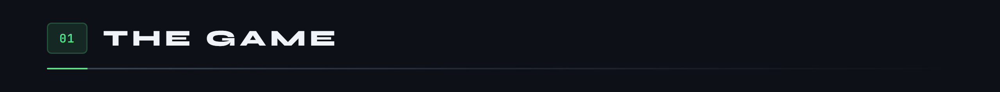
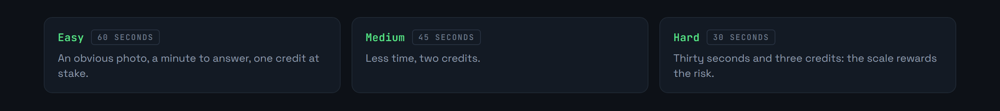
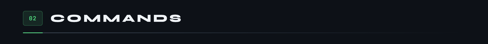
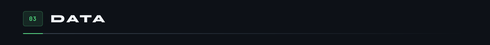
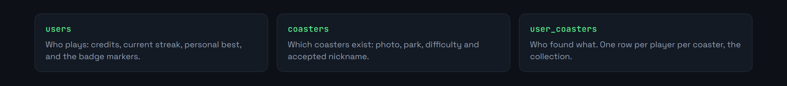
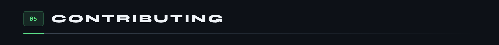

<div align="center">

<p>
  <a href="README.md"></a>
  
</p>



</div>

A Discord game for theme park enthusiasts. A player opens a round, the bot posts a photo of a roller coaster, and you have to name it before the countdown runs out.

Two ways to play. Solo, at the difficulty of your choice, to grow your collection and your streak. Or in an open competition, where the whole server searches at once and only the first to answer takes it.




In solo play, the difficulty sets both the time available and what a correct answer is worth.



With no argument, `/guess` draws a coaster at random and applies the scale of its actual difficulty. A player can only have one round open at a time.

Answers are not matched character by character: the official name and the nickname are both accepted, and a typo gets through as long as the similarity stays above 80%, a threshold lowered to 70% in competition to reward speed.

The collection is what brings people back. A coaster once found stays found, including when it was won in competition, and the profile shows what is still missing.






Three tables, one per question.



The third one is what makes the collection: one row per player per coaster found, inserted only if it is not already there.

In `users`, `streak` is the current run and `best_streak` the record, kept even when the run collapses. The two badges are markers on the player's row: `competition_winner` for a competition win, `contributor` for those who have added to the database.

On the `coasters` side, `alias` carries a coaster's nickname, accepted just as readily as its official name. That is what keeps a player from being turned down for recognising the right machine and calling it something else.


```bash
git clone https://github.com/Microcoaster/GuessTheCoaster.git
cd GuessTheCoaster
npm install
cp .env.example .env
```

Fill in `.env` with the bot token, taken from the [Discord developer portal](https://discord.com/developers/applications), and the database credentials.

```bash
npm start
```

The slash commands register at startup. Allow up to an hour before they show up everywhere if they are published globally.



The game lives on its coaster database. Adding entries with good photos is the most useful contribution there is, and `/addcontributor` exists to credit the people who do it.

For code, the cycle is the organisation's: an issue describes the work, a branch starts from `develop`, a pull request comes back onto it and goes through review.

---

<sub>MicroCoaster · Author: Cybertrist</sub>
