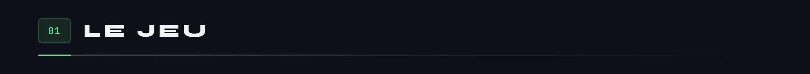
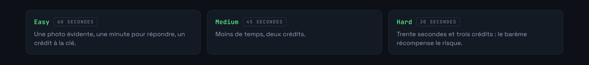
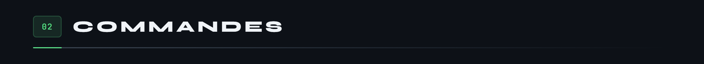
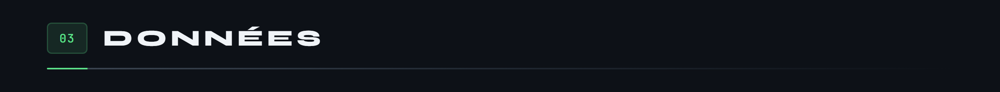
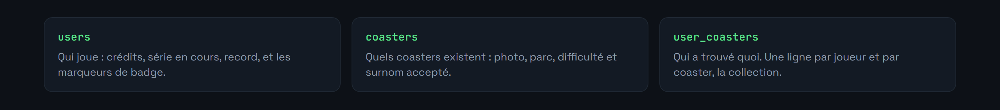
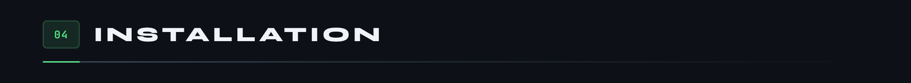
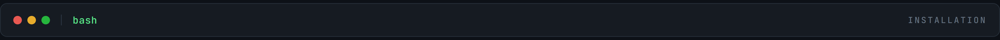
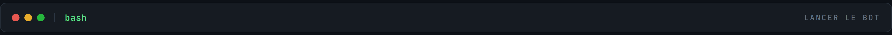
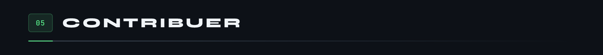

<div align="center">


</div>

Jeu Discord pour passionnés de parcs. Un joueur lance une manche, le bot affiche la photo d'une montagne russe, et il faut la reconnaître avant la fin du compte à rebours.

Deux façons d'y jouer. Seul, à la difficulté de son choix, pour faire grandir sa collection et sa série. Ou en compétition ouverte, où tout le serveur cherche en même temps et où seul le premier à répondre l'emporte.




En solo, la difficulté fixe à la fois le temps disponible et ce que vaut la bonne réponse.



Sans argument, `/guess` tire un coaster au hasard et applique le barème de sa difficulté réelle. Un joueur ne peut avoir qu'une manche ouverte à la fois.

Les réponses ne sont pas comparées au caractère près : le nom officiel comme le surnom sont acceptés, et une faute de frappe passe tant que la ressemblance reste au-dessus de 80 %, seuil abaissé à 70 % en compétition pour récompenser la vitesse.

La collection est ce qui donne envie de revenir. Un coaster déjà trouvé reste acquis, y compris quand il a été gagné en compétition, et le profil montre ce qui manque.






Trois tables, une par question.



La troisième est ce qui fait la collection : une ligne par joueur et par coaster trouvé, insérée seulement si elle n'existe pas déjà.

Dans `users`, `streak` est la série en cours et `best_streak` le record, conservé même quand la série retombe. Les deux badges sont des marqueurs sur la ligne du joueur : `competition_winner` pour une victoire en compétition, `contributor` pour ceux qui ont enrichi la base.

Côté `coasters`, `alias` porte le surnom d'un coaster, accepté au même titre que son nom officiel. C'est ce qui évite de recaler un joueur qui a reconnu la bonne machine mais l'appelle autrement.





```bash
git clone https://github.com/Microcoaster/GuessTheCoaster.git
cd GuessTheCoaster
npm install
cp .env.example .env
```

Renseigner `.env` avec le token du bot, récupéré sur le [portail développeur Discord](https://discord.com/developers/applications), et les accès à la base.



```bash
npm start
```

Les commandes slash s'enregistrent au démarrage. Comptez jusqu'à une heure avant qu'elles apparaissent partout si elles sont publiées globalement.



Le jeu vit de sa base de coasters. Ajouter des entrées avec de bonnes photos est la contribution la plus utile, et `/addcontributor` sert à créditer ceux qui le font.

Pour le code, le cycle est celui de l'organisation : une issue décrit le travail, une branche part de `develop`, une pull request revient dessus et passe en review.

---

<sub>MicroCoaster · Auteur : Cybertrist</sub>
