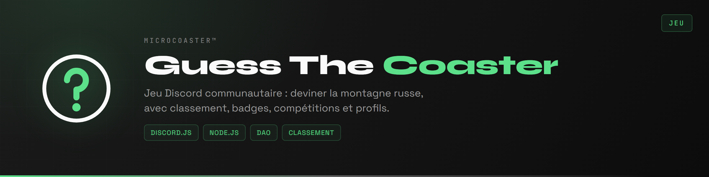

<div align="center">



</div>

Jeu Discord pour passionnés de parcs. Le bot poste la photo d'une montagne russe, les joueurs devinent son nom. Bonne réponse, des crédits et une série qui grandit. Mauvaise réponse, la série repart de zéro.

Les coasters devinés s'accumulent dans une collection personnelle, et le classement départage ceux qui les reconnaissent le plus vite.

## Comment ça se joue

```
Le bot poste une photo
Les joueurs répondent avec /guess
Bonne réponse    crédits gagnés, série prolongée, coaster ajouté à la collection
Mauvaise         série remise à zéro
```

La collection est ce qui donne envie de revenir. Un coaster déjà trouvé reste acquis, et le profil montre ce qui manque.

## Commandes

**Jouer**

| Commande | Rôle |
|:--|:--|
| `/guess` | Proposer une réponse |
| `/profile` | Collection, crédits et série d'un joueur |
| `/badges` | Badges obtenus |
| `/leaderboard` | Classement général |

**Compétitions**

| Commande | Rôle |
|:--|:--|
| `/competition` | Lancer une partie chronométrée |
| `/endgame` | Clore la partie en cours |

**Administration**

| Commande | Rôle |
|:--|:--|
| `/addcoaster` | Ajouter un coaster à la base |
| `/addcontributor` | Créditer un contributeur |

**Utilitaires**

| Commande | Rôle |
|:--|:--|
| `/commands` | Liste des commandes |
| `/about` | À propos du bot |
| `/ping` | Vérifier que le bot répond |

## Données

Trois tables, une par question.

| Table | Question à laquelle elle répond |
|:--|:--|
| `users` | Qui joue, avec combien de crédits et quelle série |
| `coasters` | Quels coasters existent, avec leur photo et leur parc |
| `user_coasters` | Qui a trouvé quoi, et quand |

La troisième est ce qui fait la collection : une ligne par joueur et par coaster trouvé.

## Installation

```bash
git clone https://github.com/Microcoaster/GuessTheCoaster.git
cd GuessTheCoaster
npm install
cp .env.example .env
```

Renseigner `.env` avec le token du bot, récupéré sur le [portail développeur Discord](https://discord.com/developers/applications), et les accès à la base.

```bash
npm start
```

Les commandes slash s'enregistrent au démarrage. Comptez jusqu'à une heure avant qu'elles apparaissent partout si elles sont publiées globalement.

## Contribuer

Le jeu vit de sa base de coasters. Ajouter des entrées avec de bonnes photos est la contribution la plus utile, et `/addcontributor` sert à créditer ceux qui le font.

Pour le code, le cycle est celui de l'organisation : une issue décrit le travail, une branche part de `develop`, une pull request revient dessus et passe en review.

---

<sub>MicroCoaster · microcoaster.com</sub>
